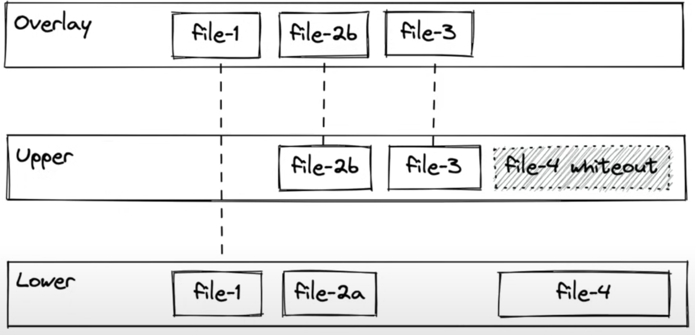
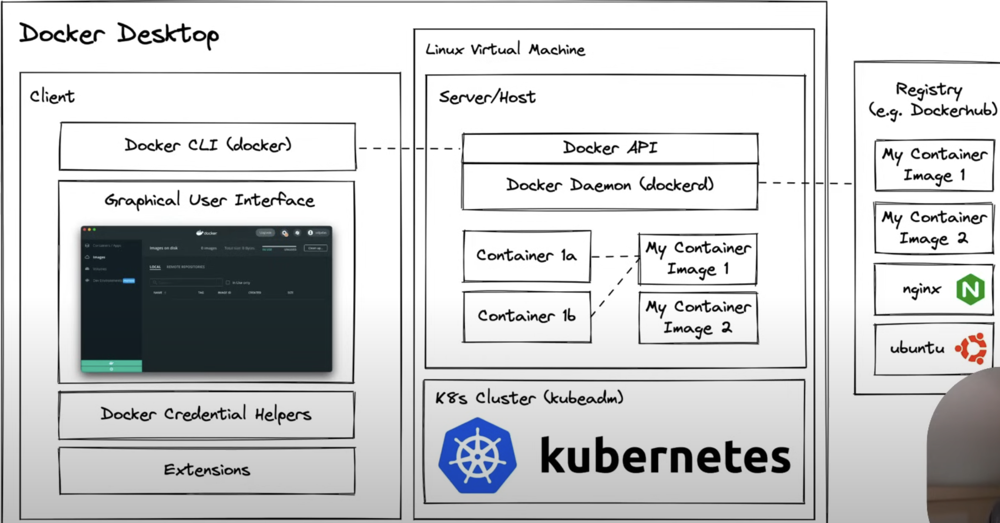

# 🐳 Docker Deep Dive Curiosity Report

## Introduction
I want to do a full deep dive on Docker! Since my DevOps engineer at my internship is incredibly knowledgeable about Docker and Kubernetes and that is within our current tech stack. I realize while doing the assignments related to Docker within the course, I still did not have a good handle on what Docker is and how it is better than past solutions. Overall, I want to be extremely familiar with these tools since containers are now the industry standard. What better time to learn than right now for this assignment.

Overall, within my studies, I wanted to research the history of why we need tools like Docker, specifically what it is, the steps took get to virtualization (Bare metal -> VM -> container), the technology overview (namely: namespaces, cgroups, and union FS), and the specific architecture of Docker running on a Mac.

---

## History
- Docker solves the problem of "well it works on my machine, but not yours." It is essentially having the local env be the same at the prd env

### Motivation: Why Containers?
#### Development
- When starting up a new job and they hand you a company laptop, instead of following a huge list of things to install (which can cause a ton of error), you are able to essentially just use `docker compose up` and now your machine has all the necessary dependencies needed to develop code.
#### Deployment
- Instead of worrying about the OS and the dependencies, as long as we have our system, our container runtime, and our containter image, we can just run it and it will be repeatedly, reliable results.

## Basics
### What is a Container?
A Docker container image is a lightweight, standalone, executable package of software that includes everything need to run a specific application. AKA its a box that has all the runtime dependencies (python, FastAPI, etc.), OS dependencies, source code.

The image is what has all those dependencies and such, but the container is that box that you run from the image

## Evolution to Virtualization
### Bare Metal
- Everything was just on a physical machine
- Horrible dependency conflicts
- Large blast radius
- Takes minutes (super slow)
- provisioning a new system takes hours to days to get a new computer up and running

### VM
- you have a physical machine that usually will have some type of OS and a hypervisor. A Hypervisor is a combination of hardware and software that allows us to carve up some resources (CPU, memory, GPUs) into isolated smaller pools that we can install our systems onto.
- No dependency conflicts
- better utilization efficiency
- small radius blast (more isolated)
- Faster startup and shutdown

### Containers
- need some hardware (physical or vm), and OS, and a container runtime
- The big difference between VMs and containers are that VMs are running their own copy of the Linux kernal while containers (being a little more lightweight) instead of running the full OS, they share the host OS kernel but isolate applications in the user space
- No dependency conflicts
- Even better utilization efficiency
- Small blast radius
- Faster startup and shutdown (seconds)
- faster provisioning and decomissioning (seconds)
- lightweight enough to actually use in deployment

## Technology Overview
There are 3 techonologies that make up a container:
1. Namespaces
2. Control Groups (cgroups)
3. Union Filesystem

### Namespaces
A Namespace, in Linux, isolates system resources for different processes. There are many different types of Namespaces:
1. PID namespace: isolates process IDs so that processes in different namespaces don't interfere with eachother. 
2. Network namespace: Each network namespace has its own network devices, IPs, routing tables, etc.
3. Mount namespace: Isolates file system mount points so different namespace can have different views of the file system.

Note: Also very important to set up the container properly because someone go into a container, break out, and then have all the same privelages, but not if we set it up properly. 

### cgroups
A cgroup is a linux kernal feature that allows processes to be organized into hiearchal groups whose usage of various types of resources can be limited and monitored

For ex: On one application, we could limit the CPU usage to 30%

### Union Mount Filesystem (Docker uses OverlayFS)
This allows you to take seperate file systems and combine them into a unified view that you can operate on.

While namespaces and cgroups are what make docker possible, it is union mount fs that makes it practical

In the above example, the overlay keeps file 1, overrides file 2a with 2b, add file 3 on the upper level, and starts with file 4 but then is deleted. 

## Docker Desktop Architecture (in detail)

While you are able to learn all of these different commands with the namespaces, cgroups, and fs, Docker packages all that up in a seamless way throught a desktop application to get all of that with a series of simple commands 

### Client
1. Docker CLI (Command Line Interface) - Whenever I run a command, for ex: `docker run` or `docker pull`, we are interfacing with the Docker CLI
2. GUI - Browsing which images you have on the system, configure the amount of CPU and memory and disk space the app has access to.
3. Docker Credential Helper - This is to help with login credentials when pushing or pulling to different regestries
4. Extensions (newer) - 3rd party that plugin that add new functionality

### Server/Host
For mac users, the mac uses a hypervisor in order to install a VM and then within that VM, it will set up 2 things: Server/Host that is known as the Docker Daemon

So when I type in command from the CLI, that command gets passed to the docker daemon (which is listening from the Docker API) and then executes that command within the server/host application

There is also an optional Kubernets cluster - we can leverage the cluster directly without having to install and leverage another cluster.

### Registry (DockerHub)
This is a place to store various container images and share them with members of your team, the world, or whomever.

---
## 🔗 Resources

Youtube: https://www.youtube.com/watch?v=RqTEHSBrYFw

GitHub Tutorial: https://github.com/sidpalas/devops-directive-docker-course
